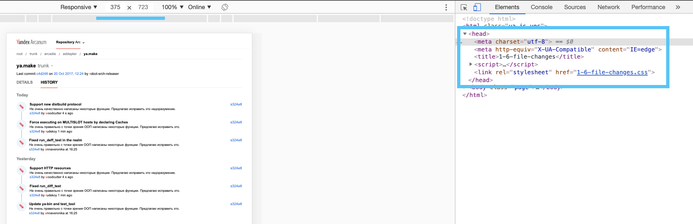
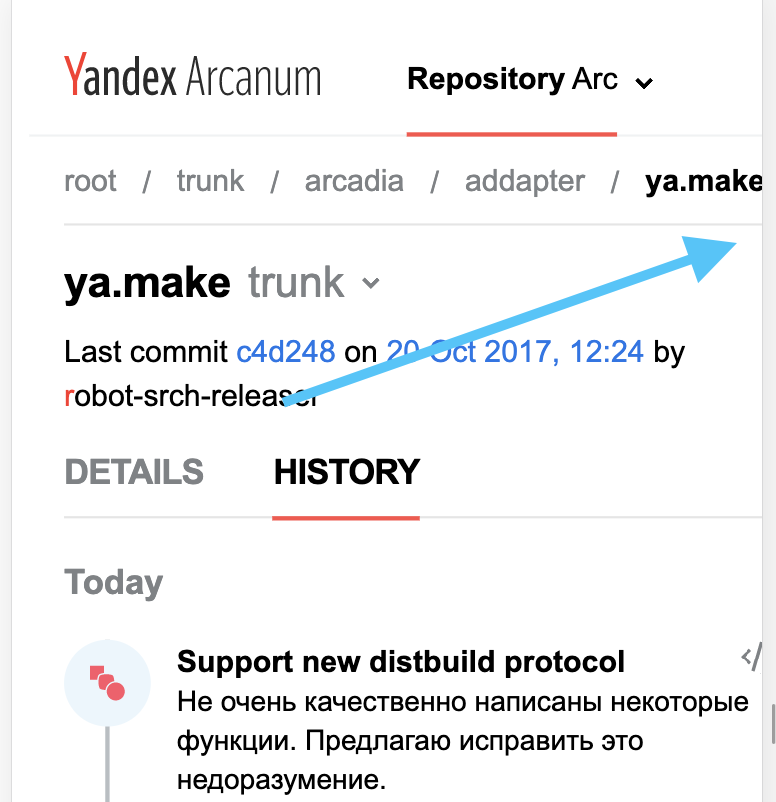
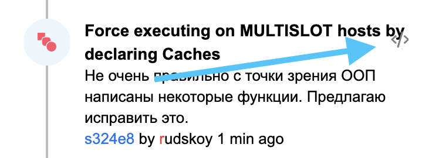
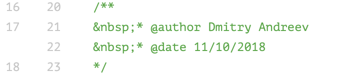
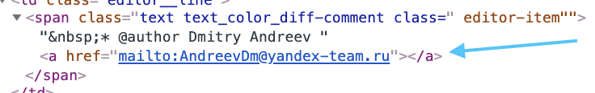

## Домашнее задание по адаптивной верстке

### Что понравилось:
- Использование препроцессора scss
- Активное использование цсс-переменных
- Использован стаб проекта от БЭМ, лойс за неизобретение велосипеда ^_^
- Сделаны все обязательные экраны
- Хорошо выглядит в мобильной верстке не только в портретной, но и в ландшафтной ориентации
- Корректная реализация БЭМ классов/элементов/модификаторов

### Что можно улучшить:
- Добавить более подробный ридми))
- Потерял мета-тег ```<meta name="viewport" content="width=device-width, initial-scale=1”>``` в ```<head>``` страницы, из-за чего адаптив не работает 
- Нет переноса блоков в пути к файлам на странице истории (1.6) - появляется горизонтальный скролл 
- На некоторых разрешениях на странице истории (1.6) блоки накладываются друг на друга 
- Добавить отступы от границ колонок в 4аблице, т.к. иначе в некоторых случаях тексты сливаются 
- В верстке коммита вылез &nbsp; )) 
- Ссылка в строке превратилась в реальную ссылку (хоть и некликабельную на странице) 

### Примечания:
- Мобильная верстка включается уже на 600 пикселей, что, кажется многовато. В целом, в задании не было обязательного требования учитывать промежуточные состояния, но лучше все же добавлять его, если есть возможность/потребность
- Возможно, в дальнейшем придется прикрутить переходы между экранами, со всеми выпадушками и прочими селектами, можно продумать, как это лучше сделать
- Стили колонок в таблице (ширина) распределяются как ```&:nth-of-type(n)``` - кажется, лучше это делать модификатором столбца, т.к. при добавлении/удалении чего-либо будет больновато искать где что поехало
- Верстка не совсем pixel-perfect (размеры шрифта, отступы) - не совсем критично, но лучше все же все размеры брать прямо из макета - тут для проверки можно заюзать расширение (например, это )
